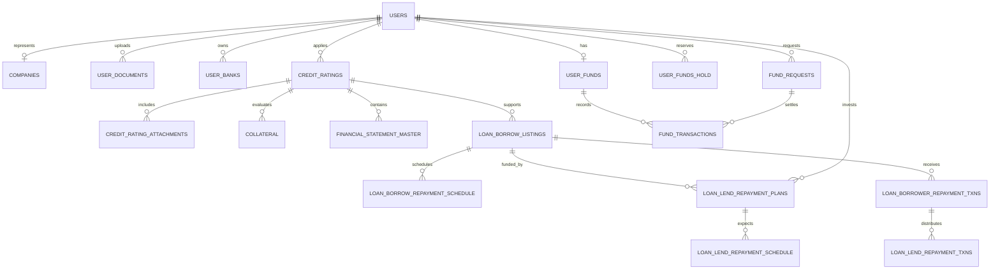

# 02 — Core Entity Relationships

**Status:** WIP — logical relationships inferred from model relations and workflow code.

## Identity and profile relationships

- `users` is the dominant aggregate root; at least 69 declared relations across models point to `User`.
- A user may act through investor or fundseeker dashboard types, while `companies` supplies corporate profile data.
- KYC, escrow/declaration, documents, references, assessments, bank accounts, devices, API keys, and security preferences attach to the user.
- Admin users are separate in `admin`; staff roles and route permissions use `role_permission` and `permissions`.

## Credit-to-loan relationships

- `credit_ratings` aggregates borrower application steps, financial data, attachments, directors/shareholders, collateral, reviews, and history.
- Approved credit data can feed `loan_borrow_listings`; exact cardinality and historical linkage need production-schema verification.
- A borrower listing owns its repayment schedule, received-payment transactions, penalties, lender plans, group restrictions, and operational notifications.

## Investment relationships

- `loan_lend_plan_requests` is an asynchronous investment-request queue.
- Successful processing creates or updates `loan_lend_repayment_plans`, one per investor position.
- Each investor position owns an expected repayment schedule and actual repayment transactions.
- Promotions/vouchers can attach adjustments to investment or payout behavior; these are not approved revamp requirements.

## Relationship integrity concerns

- Most relationships are Yii ActiveRecord declarations rather than database-enforced foreign keys.
- Naming and key types are inconsistent (`id`, domain-specific IDs, and some user IDs as primary keys).
- Several summary models reuse transaction IDs as primary keys and may represent views or denormalized reporting tables.
- The deployed database must be inspected to confirm uniqueness, nullability, indexes, cascades, and actual foreign keys.
