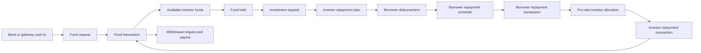
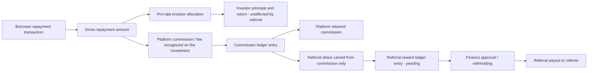

# 03 — Financial Ledger & Money Flow

**Status:** WIP — verified from model/controller usage; accounting semantics still require Finance validation.

## Legacy financial records

| Concern | Legacy records |
| --- | --- |
| User balance snapshot | `user_funds` |
| Transaction history | `fund_transactions` |
| Reserved funds | `user_funds_hold`, `user_funds_hold_history` |
| Cash-in/withdrawal request | `fund_requests`, `requests` |
| Investment intake queue | `loan_lend_plan_requests` |
| Investor ownership | `loan_lend_repayment_plans` |
| Borrower scheduled obligation | `loan_borrow_repayment_schedule` |
| Borrower received payment | `loan_borrower_repayment_txns`, `loan_payment` |
| Investor distribution | `loan_lend_repayment_txns`, `payout_transactions` |
| Gateway state | `paynamics_*`, `coins_ph`, `nuwallet_txn`, `pitakamo_request`, `paypal_*` |
| Platform commission ledger | `commisson_payments` (legacy spelling), `commission_txn_master` |
| Introducer AUM-tier commission detail | `commission_rate`, `commission_details` |
| Referral attribution (view-backed) | `user_referrals`, `introducer_members` (VIEW) |

## Observed flow

## Legacy invariants to verify

- Available funds are treated as balance less active holds.
- Investment and withdrawal flows use holds before completion or release.
- `FundTransaction` stores transaction type, reference, amount, and running/snapshot balance behavior.
- Borrower repayment is split across investor positions using investment ratios.
- Interest deductions can include platform/risk-management fees and withholding tax.
- Reversals and one-off correction scripts exist, indicating historical reconciliation failures.

## Revamp requirements derived from the review

- Use an immutable balanced ledger; cached balances must never be the sole source of truth.
- Store currency, gross amount, each fee/tax component, net amount, effective rule version, source, and idempotency key.
- Model holds as first-class records with lifecycle and expiry, not mutable balance fields alone.
- Require balanced posting groups and compensating entries for corrections.
- Separate provider state from internal settlement and ledger-posting state.
- Reconcile internal ledger, provider settlement, and bank statement independently.
- Prevent concurrent overfunding, overspending, duplicate webhook posting, and duplicate payout distribution.

## Commission and referral money flow

**Revamp direction:** one-level, lifetime-while-active referral program. Referral rewards are carved out of platform commission only — they must never be deducted from investor principal or investor returns (`tasks/README.md` § Referral model; `tasks/mvp2/03-one-level-referral.md`). Worked example: a PHP 100,000 investment recognizes 1% platform commission (PHP 1,000); a 10% referral share of that commission pays the referrer PHP 100, and the platform retains PHP 900 before other applicable charges.

### Legacy commission origin (discovery evidence, not approved design)

The legacy platform computes and posts platform commission through several overlapping mechanisms, none of which map cleanly to a single "commission revenue" ledger entry today:

- **Investor commission-fee calculators** (`CommissionLib`, identical in `admin`/`api` repos) determine the platform's own fee take before any partner payout: a flat-fee-per-tenor tier table (`tier()`) and a percentage-of-monthly-amortized-amount formula (`percentage()`, driven by an untraceable `Yii::app()->params['commission_rate']`). `percentage()` is the current live formula, computed in `CommissionMaster::details()` and re-applied by the `commission reset` / `commission percentagefix` CLI commands.
- Commission amounts are persisted per user-per-month in `commisson_payments` (legacy spelling; AR `Commission`) and anchored per user-per-month in `commission_txn_master` (AR `CommissionMaster`), both linked back to the originating repayment via `fund_transaction_id` — the same join key used elsewhere in this ledger (see `fund_transactions` above).
- A separate, more complex AUM-tiered introducer commission engine (`IntroducerLib` + `commission_rate` + `commission_details`) computes what "NU Partner" introducers are paid based on downline AUM; it depends on a `CommissionDetails` helper class that does not exist in either legacy repo, so its current production behavior cannot be fully verified from source (see `tasks/reference/legacy/domain-introducers-commission.md` § Tech Debt).
- A simple peer-referral bonus path (`UserReferral::updateReferalBonus()`) applies a flat, environment-configured `referral_bonus` amount when a referred friend's status flips to approved, rather than deriving from recognized commission at all.
- No single legacy table or column was identified that unambiguously represents "platform commission revenue" as a funding source distinct from the introducer/referral payout lines drawn against it — commission calculation, commission-as-revenue, and referral/introducer payout are intermixed across `CommissionLib`, `commisson_payments`, `commission_txn_master`, `commission_rate`, and `commission_details`. This must be resolved against production data (see 05 — Schema Gaps & Verification Plan).

**Explicitly out of scope for the revamp:** the legacy 5-level introducer hierarchy (Director → Deputy Director → Portfolio Manager → Portfolio Executive → Agency) with personal + cascaded "override" commissions, and the semi-annual AUM-tiered `introducer_bonus`. These are historical, Singapore-era, multi-level constructs; the revamp's referral model is one-level only (`tasks/README.md` § Requirement authority, "Surface conflicts... multi-level introducer commissions").

### Revamp posting model (target, still WIP)

- Platform commission is recognized as its own ledger entry at the same posting event that splits a borrower repayment into investor principal/return and platform fee — never computed after the fact from investor-facing amounts.
- The referral reward is posted as a **separate, dependent** ledger entry whose source is the platform-commission entry (by reference/idempotency key), not the repayment or investor-distribution entries. This preserves the invariant that referral rewards never touch investor principal or investor returns.
- Each referral reward entry should retain the source commission transaction reference and the rule/rate version applied, per `tasks/mvp2/03-one-level-referral.md` acceptance criteria ("historical rewards retain the applied rule version and source commission transaction").
- Referral reward states (pending, approved, payable, paid, withheld, cancelled, reversed) follow the same balanced-posting-group and compensating-entry requirements already stated above for the general ledger.

## Open schema decisions

- Double-entry account hierarchy and chart of accounts.
- Posting date versus value date versus settlement date.
- Decimal precision, rounding unit, and residual allocation.
- Treatment of pending, failed, reversed, disputed, and written-off transactions.
- Whether legacy running balances are migrated as history or summarized into reconciled opening entries.
